# Mission Control

[](#usage-quotidien-local)
[](https://v2.tauri.app/)
[](https://react.dev/)
[](https://www.typescriptlang.org/)
[](https://www.sqlite.org/)
[](#mission-control)
[](#mission-control)

Mission Control est un dashboard personnel desktop pour suivre au quotidien des projets, leurs tâches, leur progression et leurs archives, en environnement entièrement local.

**Statut actuel : MVP**

Version de build desktop actuellement packagée : **0.1.0**.

Le projet vise un cas d’usage unique :

- une seule personne
- aucun SaaS
- aucune authentification
- aucune exposition réseau publique
- un workflow desktop Linux simple et stable

## Aperçu

Mission Control fournit :

- une landing page personnelle avec résumé de progression et métriques projet
- un dashboard projets avec statut, priorité et progression réelle
- une recherche topbar pour filtrer rapidement les projets actifs
- un réordonnancement drag & drop des projets dans la pipeline active
- un mode d’archivage pour les projets `done`
- une page `Archives` en lecture seule pour les projets retirés du flux actif
- une Todo List liée au projet actif
- un menu dashboard latéral avec graphique TDL global, planning hebdomadaire et notes markdown persistées
- des compteurs `Streak` et `Medals reward` dans la topbar, alimentés par les tâches validées, les projets `done` et les archives
- des notifications de récompense temporaires sur l’accueil et le dashboard
- un réordonnancement drag & drop des tâches du projet sélectionné
- des listes étendues avec bascule `view all / show less` pour les projets et les tâches
- une persistance SQLite locale
- un packaging desktop Tauri pour Linux

## Points clés

- desktop-first avec Tauri
- thème sombre à accent orange pastel
- progression projet calculée à partir des tâches
- passage automatique à `done` quand toutes les tâches sont terminées
- recherche locale des projets actifs depuis la topbar
- réorganisation manuelle des projets et des tâches via drag & drop persistant
- archivage distinct de la suppression pour sortir un projet terminé de la pipeline active
- affichage compact avec extension à la demande via `view all / show less`
- graphique sidebar des tâches TDL terminées globales avec bascule semaine/mois
- planning local dérivé des échéances projet et enrichi par des événements/reminders libres
- bloc-notes dashboard markdown persistant en textarea avec scroll interne
- édition rapide des projets et tâches
- fallback web local conservé pour le développement

## Captures

### Landing

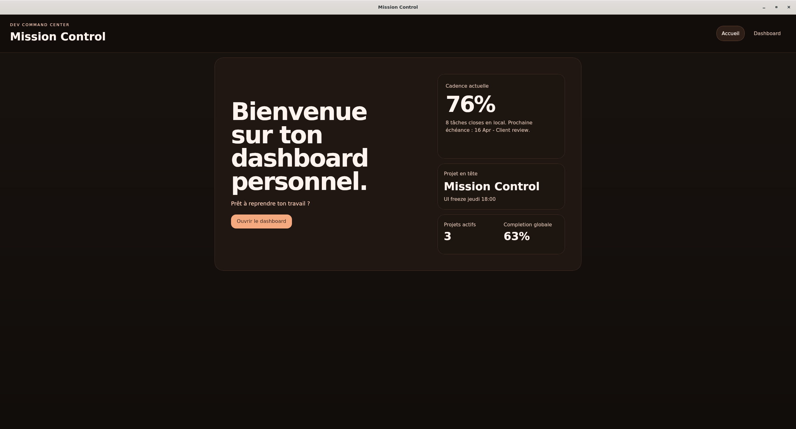

### Dashboard

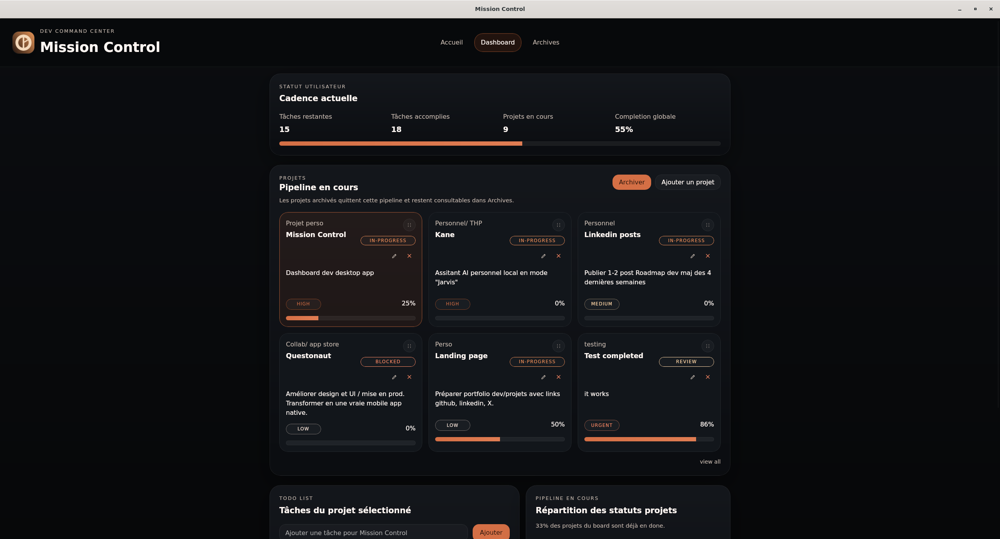
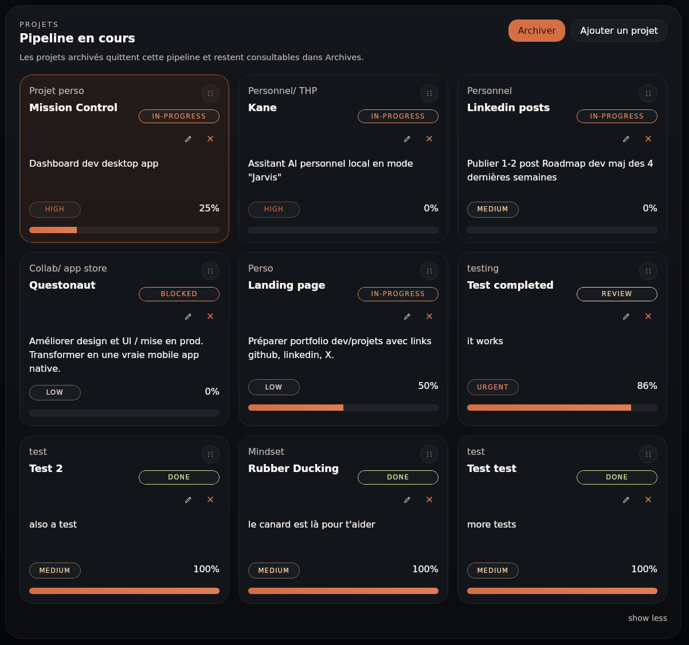
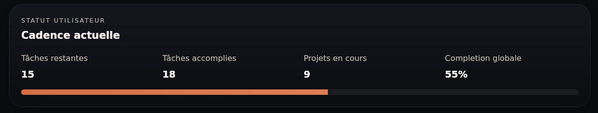
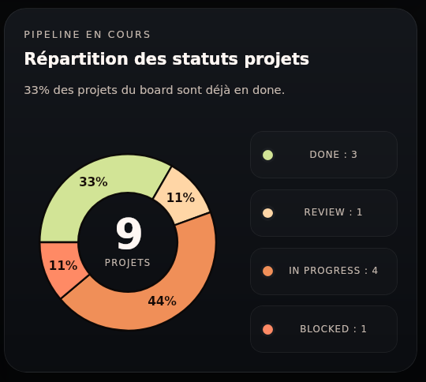
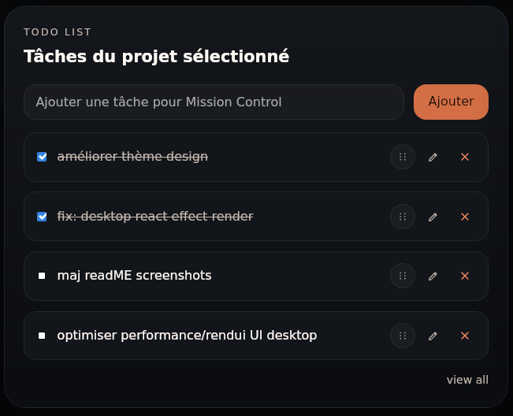

### Project Flows

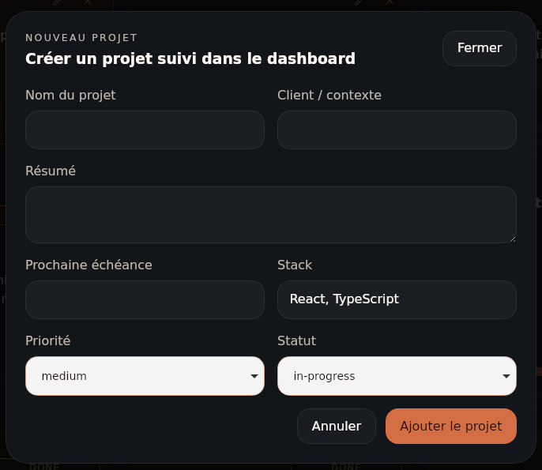
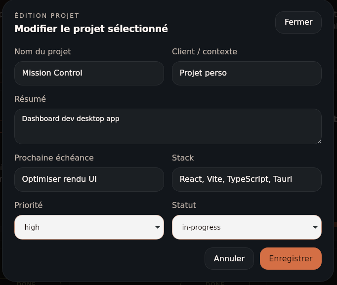
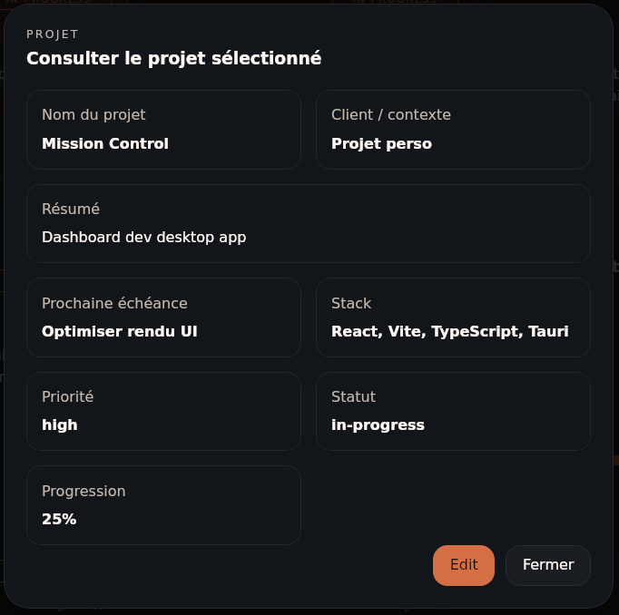
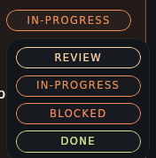
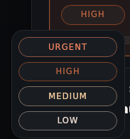
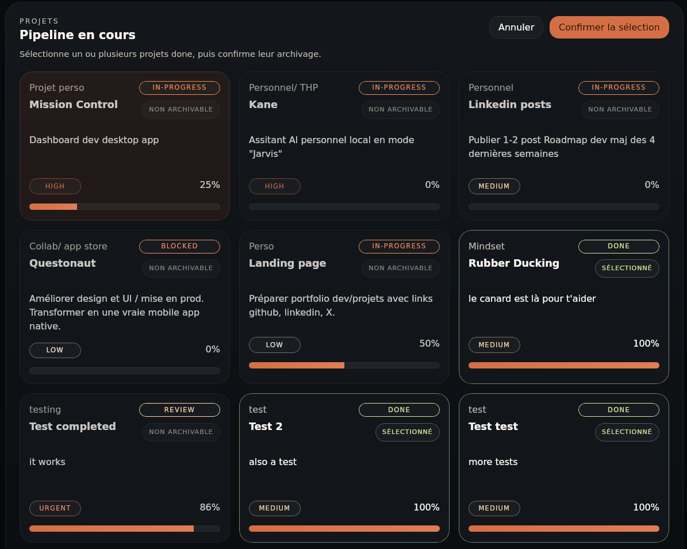
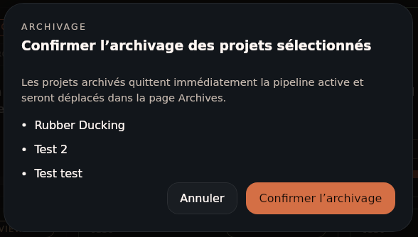

### Archives

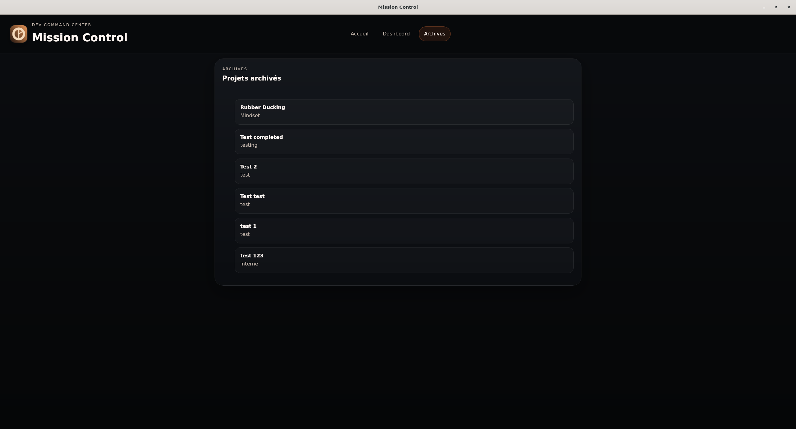

## Stack

- React
- Vite
- TypeScript
- Tauri 2
- Rust
- SQLite
- Node.js pour le fallback web de développement uniquement

## Architecture

- `src/` : UI React, pages, composants, transport, hooks métier
- `src-tauri/` : shell desktop, commandes Rust, persistance desktop, bundle config
- `server/` : API Node locale et SQLite fallback pour le mode web
- `scripts/` : scripts de lancement, build et setup local


Le runtime produit cible est le desktop Tauri.  
Le backend Node reste conservé pour le développement web local et les vérifications de fallback.

Le snapshot utilisateur affiché dans le dashboard et sur la landing agrège désormais :

- tâches accomplies
- tâches restantes
- projets en cours
- completion globale

## Prérequis

Environnement cible :

- Ubuntu 24.04
- Node.js et npm
- Rust via `rustup`
- dépendances système Tauri

Helper Ubuntu :

```bash
cd /home/user/path/to/mission-control
npm run tauri:setup:ubuntu
```

Diagnostic environnement :

```bash
npm run tauri:info
```

## Installation

```bash
cd /home/user/path/to/mission-control
npm install
```

## Usage Quotidien Local

Le workflow produit actuel est centré sur le package `.deb`.

### Utiliser Mission Control comme app desktop installée

1. Build la version desktop :

```bash
cd /home/user/path/to/mission-control
npm run tauri:build
```

2. Trouve le package généré (depuis racine du projet) :

```bash
find src-tauri/target/release/bundle -name "*.deb"
```

3. Installe-le :

```bash
sudo apt install ./src-tauri/target/release/bundle/deb/"Mission Control_0.1.0_amd64.deb"
```

4. Lance ensuite **Mission Control** depuis :

- le menu des applications Ubuntu
- ou le dock si l’app est épinglée

Important :

- le `.deb` installé est un snapshot packagé
- si tu modifies le code source, l’application installée ne se met pas à jour seule
- pour mettre à jour l’app installée, il faut refaire `npm run tauri:build` puis réinstaller le nouveau `.deb`

### Développer la version desktop

```bash
cd /home/user/path/to/mission-control
npm run tauri:dev
```

Si la stack graphique Linux est instable :

```bash
MISSION_CONTROL_SOFTWARE_RENDERING=1 npm run tauri:dev
```

### Fallback web de développement

```bash
cd /home/user/path/to/mission-control
npm run dev
```

Ce mode lance :

- le serveur Vite
- l’API Node locale
- la base SQLite locale du fallback web

Le script `npm run app` reste disponible comme lancement navigateur local buildé, mais ce n’est plus le mode produit recommandé.

### Démo statique GitHub Pages

```bash
cd /home/user/path/to/mission-control
npm run build:static
npm run preview:static
```

Ce mode produit une démo navigateur autonome pour `https://crousty24-bit.github.io/mission-control/`.

- aucune API Node ni runtime Tauri
- données initiales de démo seedées côté front
- actions persistées dans le `localStorage` du navigateur
- navigation en hash URLs (`#/dashboard`, `#/archives`) pour éviter les 404 GitHub Pages

Le workflow GitHub Actions `Deploy static demo to GitHub Pages` build et publie automatiquement le dossier `dist`.

## Workflow de Développement

### Travailler sur l’application

```bash
npm run tauri:dev
```

Utilise ce mode pour :

- modifier l’UI
- tester les interactions desktop
- valider le comportement Tauri

### Publier une nouvelle version desktop locale

```bash
npm run tauri:build
sudo apt install ./src-tauri/target/release/bundle/deb/"Mission Control_0.1.0_amd64.deb"
```

Puis relance l’application depuis le menu système.

## Scripts utiles

```bash
npm run dev
npm run dev:front
npm run server
npm run app
npm run db:reset
npm run build
npm run build:server
npm run build:static
npm run preview:static
npm run lint
npm run lint:eslint
npm run lint:biome
npm run lint:biome:files -- src/main.tsx src/api/tauriRuntime.ts
npm run lint:biome:write:files -- src/main.tsx src/api/tauriRuntime.ts
npm run tauri:dev
npm run tauri:build
npm run tauri:info
```

## Vérification

Checks recommandés :

```bash
npm run lint
npm run lint:eslint
npm run lint:biome
npm run build
npm run build:server
npm run tauri:info
cargo check --manifest-path src-tauri/Cargo.toml
```

Procédure Biome pour les changements courants :

- utilise `npm run lint:biome:files -- <fichiers_modifiés>` avant de conclure une tâche
- applique les corrections sûres avec `npm run lint:biome:write:files -- <fichiers_modifiés>`
- traite ensuite manuellement les diagnostics `lint/*` restants sur le même périmètre
- réserve `npm run lint:biome` à l’audit global ou aux lots dédiés de normalisation
- `npm run lint:eslint` reste actif temporairement comme contrôle secondaire pendant la transition

## Logique produit récente

- `Completion globale` reste calculée à partir des tâches terminées sur les projets non archivés
- `Projets en cours` correspond à tous les projets non archivés visibles dans le board, y compris les `done`
- la recherche topbar filtre uniquement les projets actifs du dashboard et n’affecte pas l’ordre persisté
- un projet archivé disparaît du dashboard actif et reste consultable dans la page `Archives`
- l’archivage n’est autorisé que pour un projet en statut `done`
- l’ordre des projets dans le board peut être réorganisé par drag & drop et reste persisté
- l’ordre des tâches d’un projet peut être réorganisé par drag & drop et reste persisté
- les sections projets et tâches restent compactes par défaut puis s’étendent avec `view all / show less`
- le graphique de la sidebar suit le nombre global de tâches TDL terminées, sans répartition par projet
- le planning dashboard affiche une semaine lundi-dimanche, combine les événements libres persistés et les échéances projet dérivées du champ `milestone`
- les échéances projet sans date exploitable restent visibles dans `À planifier`
- la note dashboard est unique, persistée localement et éditée en markdown dans une textarea sans aperçu rendu
- le streak journalier gagne au plus +1 par jour lorsqu’une tâche est validée ou qu’un projet passe `done`, puis repart à 0 après 7 jours de cycle
- `Medals reward` correspond au nombre total de projets archivés et les récompenses déclenchent une notification locale de 3 secondes

## Notes Linux / Tauri

Sur certaines machines Linux, WebKitGTK peut produire des warnings `libEGL`, `MESA` ou `ZINK` pendant `tauri:dev`.

Mission Control applique déjà plusieurs garde-fous :

- `WEBKIT_DISABLE_DMABUF_RENDERER=1`
- `LIBGL_KOPPER_DISABLE=true`
- fallback logiciel via `MISSION_CONTROL_SOFTWARE_RENDERING=1`

Le mode `tauri:dev` reste un mode debug. Le rendu release via package `.deb` est la référence produit.

## Intégrité du Projet

État actuellement vérifié localement :

- `npm run lint`
- `npm run build`
- `npm run build:server`
- `cargo check --manifest-path src-tauri/Cargo.toml`
- `npm run tauri:info`
- `npm run tauri:build`

## Informations Complémentaires

- **le projet est pensé pour un usage personnel local et mono-utilisateur**
- **la persistance desktop Tauri est locale et hors du repo**
- **la base SQLite du fallback web ne doit pas être versionnée**

## Mode Pédagogique avec `tasks-review.md`

Le fichier [tasks-review.md](tasks-review.md) sert de cadre pour utiliser un agent IA, ici Codex, comme **assistant pédagogique** pendant le développement du projet.

L’objectif est double :

- construire réellement l’application
- pouvoir, en parallèle, poser des questions sur l’architecture et le code pour apprendre en avançant

Quand ce mode est activé avec un prompt du type `Tasks: ...`, l’agent doit basculer en posture de mentor et :

- expliquer le rôle des composants
- montrer où vivent les `props` et les `state`
- expliquer la couche API, Tauri, SQLite et le build desktop
- répondre de manière pédagogique sans modifier le code

L’utilité est particulièrement forte pour un développeur qui débute avec :

- React
- Vite
- TypeScript
- Tauri

La démarche consiste à **apprendre sur le tas tout en développant son projet**, au lieu de séparer totalement apprentissage et implémentation.

Le principe est générique : il peut s’appliquer à n’importe quel autre projet ou stack, tant qu’un fichier similaire existe pour cadrer le comportement pédagogique de l’agent.

## Roadmap


| Sujet | Objectif |
| --- | --- |
| Finition graphique Linux | Ajuster encore le rendu selon la machine cible et la pile WebKitGTK / Mesa. |
| Fallback web | Continuer à simplifier la couche Node/SQLite conservée pour le développement. |
| Scope produit | Garder le dashboard compact, local et strictement personnel. |

## Licence

Ce projet est publié sous licence [MIT](LICENSE).
